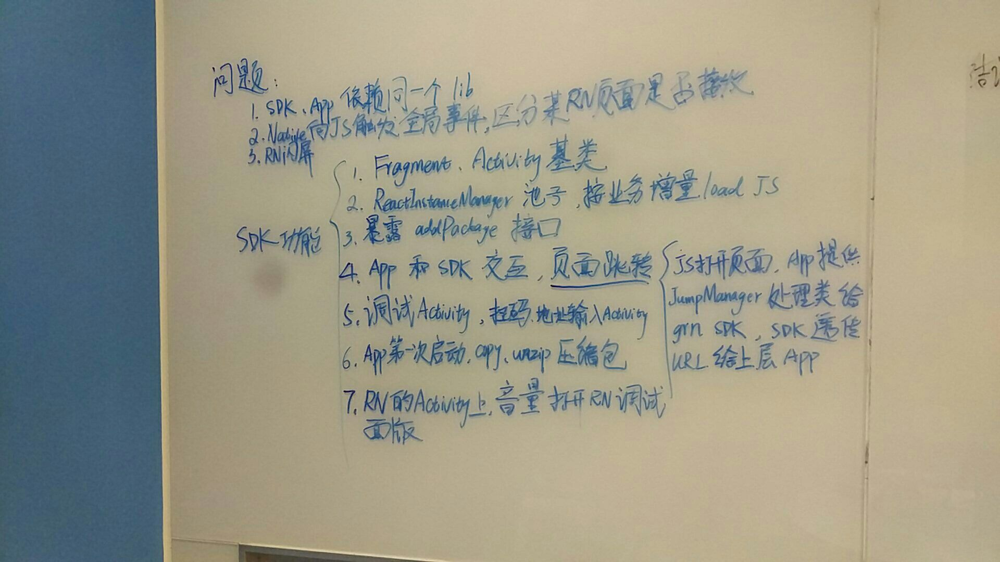
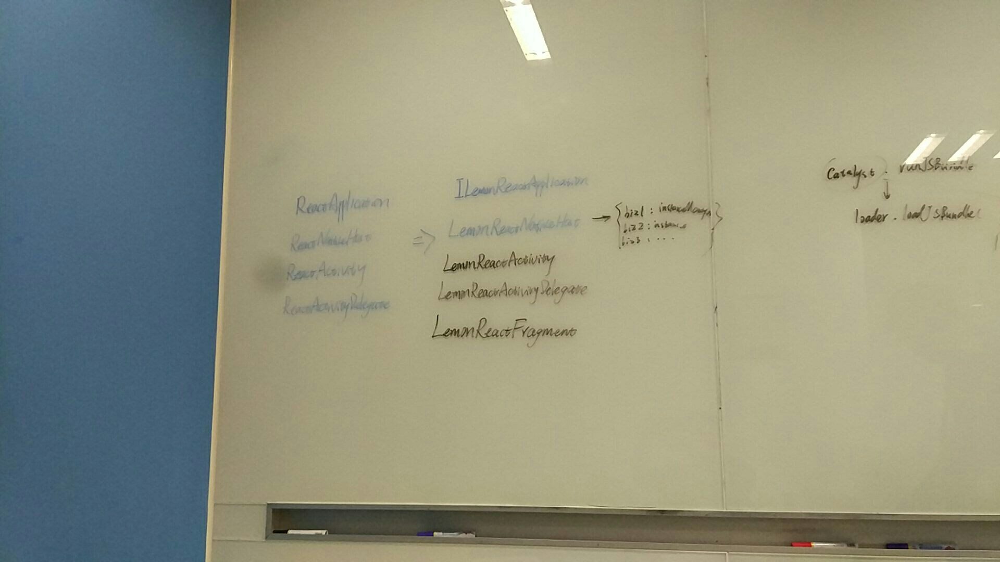

# 5月1号 ~ 5月7号


## 5月2号

### `react-native`第三次讨论，SDK功能细化

其实这是上周4月26号讨论的，当时忘记写了，今天补上，主要是明确了`SDK`中具体的一些功能，以及在封装
`native`功能时的代码组织原则。

先暂时将我们的`react-native SDK`命名为`lemon`吧，下文的`lemon`都是指的我们封装的`react-native SDK`.

#### 主要结论

* `lemon`内部依赖`react-native框架`，上层应用 **不直接依赖`react-native 框架`**，上层应用
直接依赖`lemon`
* `lemon`包含对`react-native`的初始化，提供公共的`package`添加方法等
* `lemon`内部维护`ReactInstanceManager`的池子，增量加载各个业务对应的`bundle`
* `lemon`提供封装好的`Fragment` `Activity`基类，用于渲染`RN页面`
* `lemon`提供调试功能，封装扫码、音量键打开RN调试面板等

具体见下图：




### 今日总结

在Android的React Native demo app里，尝试去掉框架提供的 `ReactNativeHost`，封装了自己的 `LemonReactNativeHost`,
`LemonActivity`, `LemonActivityDelegate`， `ILemonReactApplication`。

`LemonReactNativeHost`里会根据不同的 **业务类型** 维护一个 `ReactInstanceManager` 的池子，提供给
不同的业务视图使用。

React Native框架本身在Android里，默认全局就 **一个** `ReactInstanceManager`，通过之前讨论，
**不再** 使用原生自带的`ReactActivity`, `ReactActivityDelegate`, `ReactNativeHost`, `ReactApplication`。

在`Lemon*`的类里，`LemonReactNativeHost`仍然全局唯一，但是`ReactInstanceManager`可以是多个，而且
不同的业务模块会依赖不同的`ReactInstanceManager`。

改动之后，在自己扩展的继承自 `ReactContextBaseJavaModule` 的原生模块类上，需要获取到当前`Activity`
背后的`ReactInstanceManager`，原生代码是全局就一个`ReactInstanceManager`，所以没问题；经过
改动之后，不同的`业务视图`对应不同的`ReactInstanceManager`。为了能够在`Activity`里获取到`ReactInstanceManager`，
我在`LemonActivityDelegate`持有了一个`ReactInstanceManager`的引用，在`new LemonActivityDelegate`的时候，
会根据当前的 **业务类型** 从 `LemonReactNativeHost` 的池子里，获取一个`ReactInstanceManager`，如果
对应的 **业务类型** 没有`ReactInstanceManager`，会重新创建一个，并放到池子里。

上面这个改动，感觉很可能有问题，需要确认下，`React Native原生模块`有没有直接通过`ReactNativeHost`来获取
`ReactInstanceManager`实例的。


## 5月3号

### `react-native`第四次讨论，SDK具体类梳理

基本上确定了上面的4个类：`ILemonReactApplication`, `LemonReactNativeHost`, `LemonActivity`,
`LemonActivityDelegate` 代替原生框架自带的4个。

明确了，在封装的 `SDK` 里，`ReactInstanceManager` 和 **业务类型** 是 **1对1** 的关系，即：

1. 1个`ReactInstanceManager`只会包含一种 **业务类型** 的bundle，不会加载多个业务bundle
2. 同一个 **业务类型** 下的所有页面，共享同一个 `ReactInstanceManager`
3. 一个 **业务** 代码异常，只会影响该业务对应的所有页面，不会影响到其他的业务

讨论的截图如下：




### 今日总结

在尝试多个`ReactInstanceManager`并存中，发现在RN页面内，通过`NativeModule`调用`ReactInstanceManager.recreateReactContextInBackground`，经常出现下面的warning：

```
W/unknown:React: Tried to enqueue runnable on already finished thread: 'native_modules... dropping Runnable.
W/MessageQueue: Handler (com.facebook.react.bridge.queue.MessageQueueThreadHandler) {501fcd} sending message to a Handler on a dead thread
                                                                 java.lang.IllegalStateException: Handler (com.facebook.react.bridge.queue.MessageQueueThreadHandler) {501fcd} sending mess
```

看样子应该是`Catalyst`销毁之后，JS还在向native的线程发事件，但这时候老的native线程已经destroy了。
但没明白为什么会出现这个问题，明天继续跟进下。

## 5月4号
