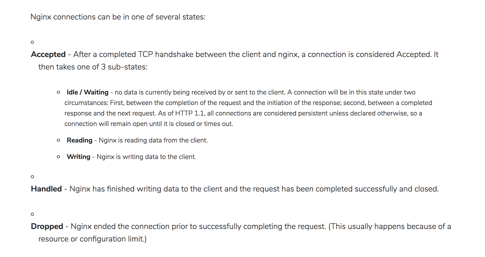
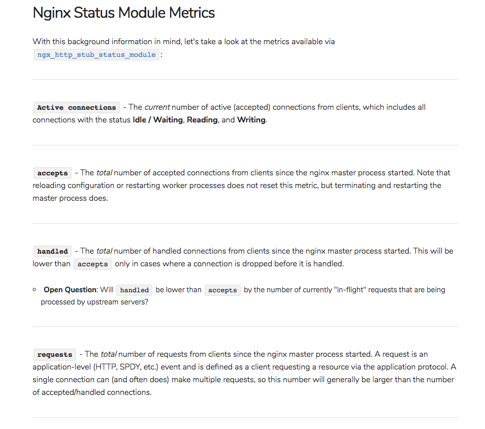
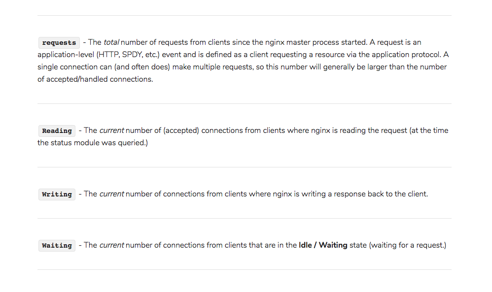

# 记一次网站访问异常

还是一个周三的中午，正吃着午饭，二货突然说高层群里报线上异常，APP访问接口失败！赶紧拿手机试，真是
又挂了！因为前几周刚出过线上大量超时的事故，心想完了，不会又是nodejs超时吧。和二货回到公司，再看
现象，又和之前的超时有点区别：之前超时是APP里刷新很久，最后报异常；这次是刷新立即报请求失败。莫不是CDN
出问题了？

## CDN异常？

打开PC端页面，发现动态请求(需要回源)响应很慢，但是能成功返回；静态资源(缓存在CDN)大量请求失败，返回
`http status code` 包含 **533**， **564**， **532** 等。

根据我了解到的，我们服务器 **所有请求** 都会经过CDN，只是 **动态请求** 会回源到我们服务器；静态资源
缓存在CDN上。因此，看上面的现象，感觉是 **CDN异常** 了，因为凡是回源到我们自己server的请求都是OK
的，而直接走CDN的静态资源却大量异常。

这时候我想法很简单，既然回源到自己server没问题，那 **所有请求不走CDN，直接把域名指向我们自己服务器**
应该能解决了。事实证明我还是 too young 。OP告诉我，不能把域名指向我们真实服务器，那样 **会暴露服务器
的公网IP，容易被人攻击** 。纳尼？还有这个说法么，我确实还不知道……

后来我查了一下，原来CDN不仅仅是我理解的那样，缓存静态资源，加速网站访问。还有什么 “高防CDN”，能帮助
全站抵抗DDOS请求，过滤掉一些恶意流量。难怪刚来公司时，听说我们全站都走的CDN，当时很不理解，现在终于
解决了那时的疑惑了。

所以一般都不会暴露自己的服务器真实IP，而是在DNS上用 `CNAME` 到CDN提供的域名。但是，我看到一篇文章
说，可以通过不同的方式来尝试寻找真实的服务器IP，有的网站，只是在 二级域名 做了CNAME，但是 一级域名
还是A记录到自己服务器IP的，因此用 `nslookup` 还是能找到网站的真实IP。比如 `www.example.com`
的DNS解析是 `CNAME` 到别的CDN域名，但是 `example.com` 却没有加(可能忘记了？)，因此使用
`nslookup example.com 8.8.8.8` 还是能找到该网站真实的服务器IP。

OK，既然怀疑CDN有问题，OP同学还是 **强制所有请求，都经过CDN回源** ，理论上这样应该是能修复的。

## 机房网络线路故障？

在操作上面 **强制所有请求，经过CDN回源** 的同时，OP同学还把 **内网DNS上，我们自己的域名，直接解析到F5设备**，
期望自己内网请求，不经过CDN，直接到达我们自己服务器，能够快一些吧。然而，这一切似乎并没有太多卵用:(

因为我这时候在公司内网，访问我们网站直接请求到了F5，不经过CDN，刷新PC页面，大量的 **请求拒绝连接**，
甚至页面请求都经常被拒绝！！

There must be something wrong!!

嗯，再想，确实有问题，之前网站流量大的时候(其实也不算大)，后端服务扛不住，**为了服务稳定**，OP同学在
F5上做了限流，貌似 **单个域名** 限流为1000(这里也有我之前的误解，原来以为1000是说到达F5的所有请求，
现在才知道，原来是针对不同域名设置的)。所以拒绝连接就正常了，因为现在 **所有请求** 都回源到了F5，
包括大量的静态资源，想想我们一个页面，都有四五十个静态资源，那肯定会触发F5的限流。

## 备用机房？

显然，**全部流量回源到F5**，会触发F5限流，还是不行。

这时候，终于又知道了一件事情，我们有个备用机房！原来，我们线上是有2个机房的啊(热泪盈眶)，这么机密的事情，
居然因为这次事故，被暴露给我们底层码农了。

OK，第一次尝试 **全部流量经CDN回源到机房A** ，出发了机房A的F5限流；OP同学果断把 **部分流量经CDN回源
到备用机房B**，备用机房用 `nginx`(不是F5) 来接收。

据OP同学说，是把 **PC端流量，即 www 的二级域名** 都切到了备用机房B；移动端流量还是去机房A。

现在访问PC站，走备用机房的nginx，貌似还行；有点记不清，当时有没有测试APP上的访问了……稍微有点尴尬:(

哦，貌似想起一点，当时我访问 m 站，因为我在内网，所以内网DNS是直接把域名解析到了机房A的F5上，还是很慢！！
而且，请求任意的图片，在chrome里观察network时间轴，TTFB 总是在 54秒 左右！！

TTFB居然要54秒，而且还是一个静态的图片，实在想不到这么多时间是花在哪个地方了……我现在请求是直接到达的
机房F5，没有经过CDN，这锅CDN是没法背了。但应该不是F5流量大导致的，如果超出阈值，会直接拒绝连接。
那是怎么个意思呢，机房前面的网络出问题了么，被挖掘机挖掉一半莫不是？应该不是F5的什么问题吧，毕竟几十万
一台的高级货。

## nginx writing 异常的高

经过上面的操作，即 `www` 子域的流量回源备用机房B，`api` `m` 子域的流量仍然回源到主机房A，问题并
没有彻底解决。备用机房的请求是基本OK的，虽然也比较慢，但好歹也就10秒以内能返回了。A机房呢，请求一个
静态的图片资源，TTFB都是54秒，蛋蛋的忧桑中。

这时候，二货说机房A的nginx监控上，`writing connection numbers` 异常的高，但是说不清和什么有关系。
并且在晚上9点左右，有一段时间网站请求恢复的时候，`writing`的值也恢复到正常水平，看现象来说，`writing`值
偏高和网站响应慢，是有联系的。

附上文末一篇链接里，对`nginx connetion status`的描述，感觉这个很重要，所以单独截图出来了，具体看
文末相关链接的文章吧。

再贴一下 `nginx stub status module` 里统计到的各个连接状态值的含义吧：

但到底是什么导致的，现在仍没个说法……

## 机房网络线路？

这都是事后第二天，我听二货说的了。当晚他们也怀疑过是不是主机房的网络线路有问题，还打电话叫来了机房老板，
但机房老板很确定的告诉他们机房线路没问题，并且其他公司都已经恢复了，只是我们公司的还有问题(不带这么打脸
的好吗！)……

## F5 ？

机房线路没问题，那为什么请求巨慢呢？可能是F5的问题么？但是这么贵的高级货，还能出啥问题呢？并且OP同学
很确信F5没问题……

并且，F5上还没有日志……据OP同学说，F5磁盘只有几个G，如果打日志，很快就能把磁盘打满，所以没有日志。

## 戛然而止

机房网络线路没问题，F5没问题，nginx writing偏高。嗯，情况就是这么个情况，那到底哪儿有问题嘛，请求
为何这么慢呢，总的有个XX来背锅嘛……

万万没想到，服务最终还是恢复了，👏！

二货他们熬到凌晨1点过，**还是没定位到什么问题**，网络莫名其妙的，就这么神奇的，又好了……

## 相关链接

* [ngx_http_stub_status_module](https://nginx.org/en/docs/http/ngx_http_stub_status_module.html)
* [an-in-depth-guide-to-nginx-metrics](https://www.scalyr.com/community/guides/an-in-depth-guide-to-nginx-metrics)

-------- 时2017年7月1日 16：08 竣工于帝都望京东
